# DocumentManager Back-End & Front-End

## Présentation

L'application DocumentManager est un gestionnaire de documents, composée de deux modules distincts :

1. Module d'Administration (Réservé aux administrateurs) :
    - Dans ce module, les administrateurs de la plateforme ont accès à des fonctionnalités avancées pour gérer les catégories et sous-catégories de documents.
    - Ils peuvent créer, modifier et supprimer des catégories, ainsi qu'attribuer des sous-catégories à chacune d'entre elles.
    - Ce module offre un contrôle total sur les paramètres de l'application.

2. Module de Visualisation et Gestion des Documents (Ouvert à tous les utilisateurs connectés) :
    - Ce module permet à tous les utilisateurs connectés de visualiser et gérer les documents disponibles.
    - Les documents sont classés dans des catégories et des sous-catégories, ce qui facilite la recherche et la navigation.
    - Les utilisateurs peuvent parcourir les documents par catégorie, titre, description et auteur du document.
    - Ils ont la possibilité de télécharger les documents.

L'application permet de mettre en ligne des documents dans un environnement organisé, et les administrateurs jouent un rôle clé dans la gestion de ces documents.

## Fonctionnalités Clés

### Authentification

Utilisation du JWT avec la comparaison et hachage des mots de passe en utilisant BCrypt.  

AspNet fournit aussi un SignInManager mais celui-ci est plutot destiné aux app coté serveur au lieu de spa.
Cela signifie que ASP.NET fournit un composant appelé SignInManager, généralement utilisé dans les applications côté serveur (comme les applications MVC ou Razor Pages). Cependant, dans le contexte d'une application basée sur une architecture SPA (Single Page Application), il est indiqué que l'utilisation de SignInManager peut ne pas être aussi appropriée. Les applications SPA ont souvent des besoins d'authentification spécifiques qui peuvent être mieux gérés avec d'autres mécanismes, tels que l'utilisation de JWT.

### Catégorisation des Documents
- Les administrateurs peuvent créer et gérer des catégories de documents.
- Ils peuvent attribuer des sous-catégories à chaque catégorie, permettant une organisation hiérarchique.

### Proposition de Documents
- Les utilisateurs peuvent proposer l'ajout de documents existants à une sous-catégorie.
- Un document se compose d'un titre, d'une description et d'un fichier téléchargeable.
- Chaque proposition de document doit être validée par un administrateur avant d'être accessible à tous les utilisateurs.

### Filtrage et Recherche
- Un panneau de filtres permet aux utilisateurs de rechercher des documents en fonction de la catégorie, du titre, de la description et de l'auteur du document.
- Cette fonctionnalité facilite la découverte de documents pertinents.

### Abonnements
- Les utilisateurs ont la possibilité de s'abonner à une catégorie ou une sous-catégorie.
- Ils recevront une notification par e-mail chaque fois qu'un nouveau document est ajouté à la catégorie ou sous-catégorie à laquelle ils sont abonnés.
- Les notifications sont envoyées uniquement après la validation du document par un administrateur.
- Le modèle de l'e-mail de notification est personnalisable via le module d'administration, avec la possibilité d'inclure des champs de fusion pour afficher l'URL, le titre et la description du document.

## Prévisualisation

### Administration Dashboard

- Categories
  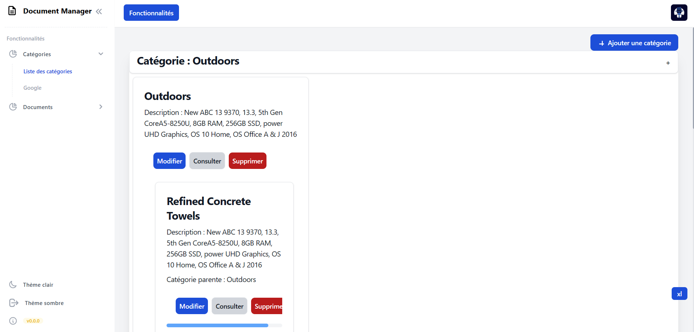

- Dark Theme
  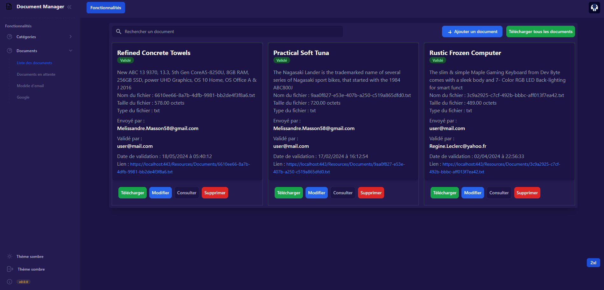

- Documents
  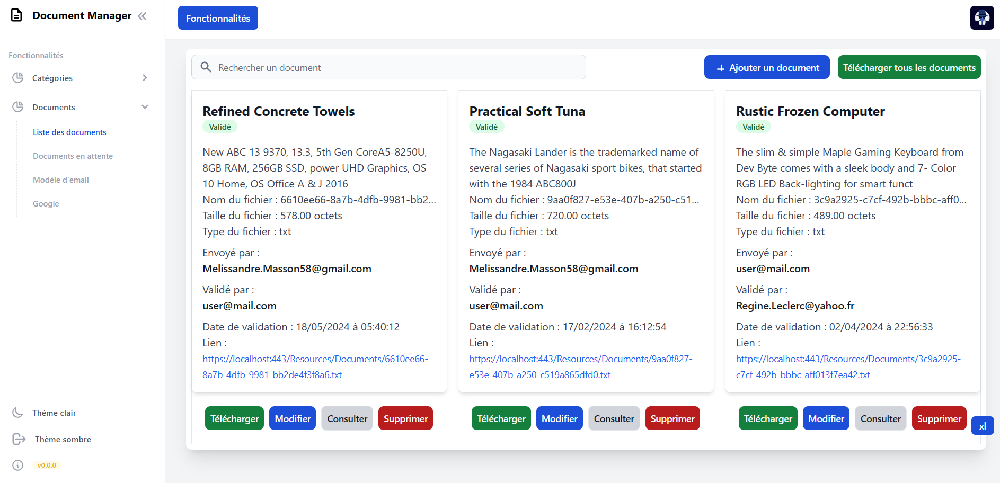

- Document Validation
  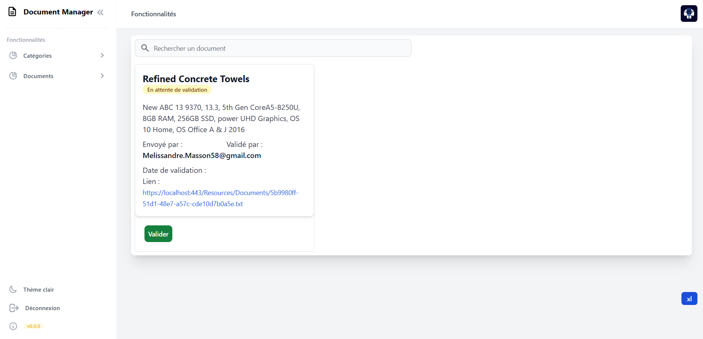

- Email Template
  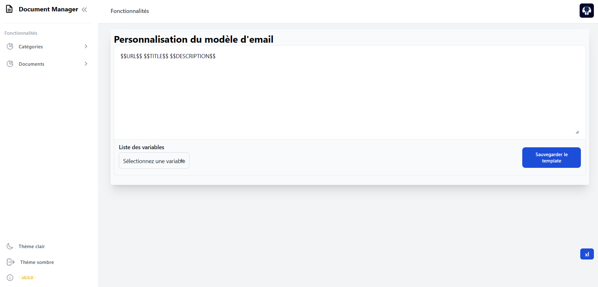

### User Dashboard

- Categories
  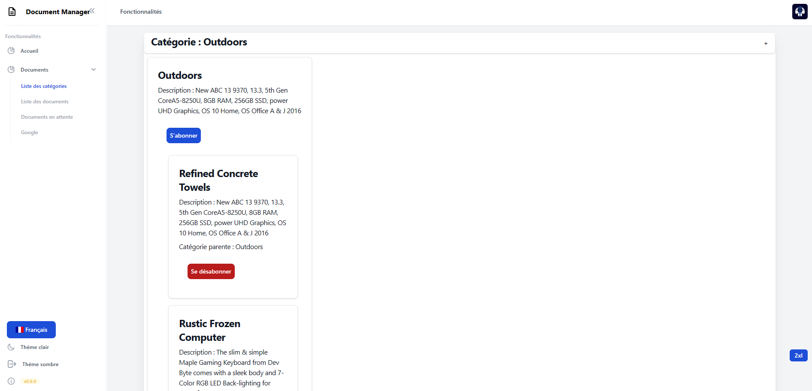

- Documents
  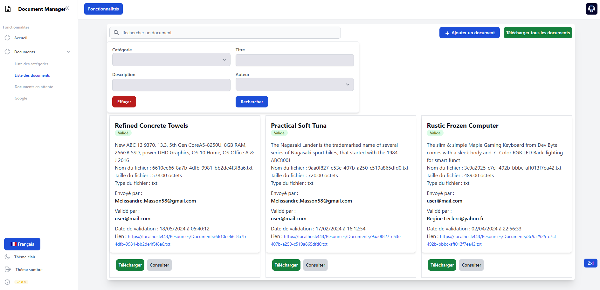

- Home
  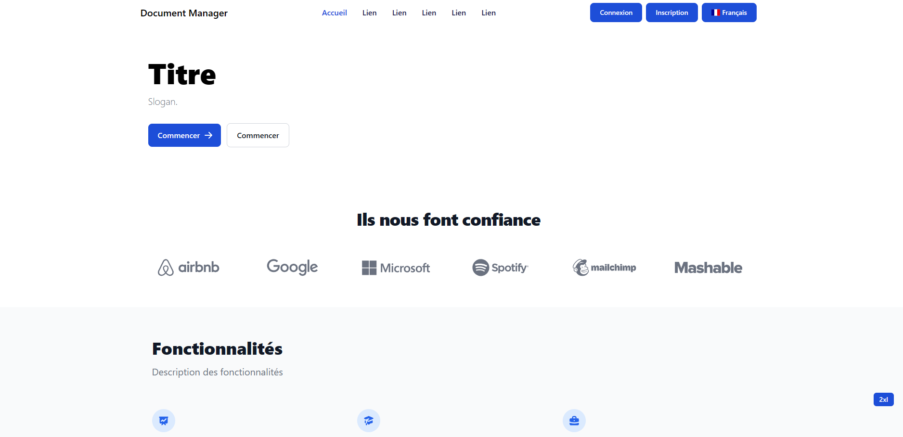

### Public Pages

- Login
  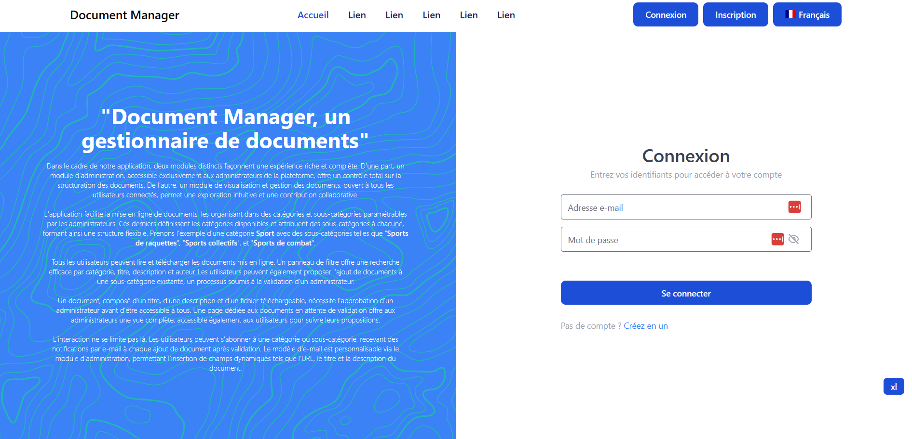

- Login (English)
  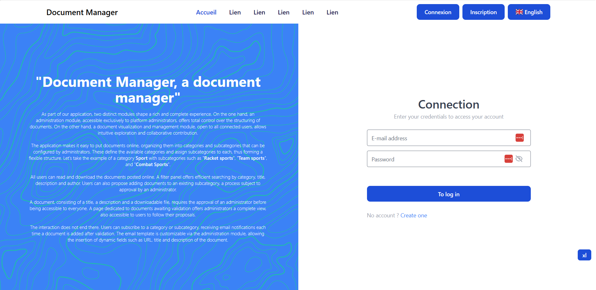

- Register
  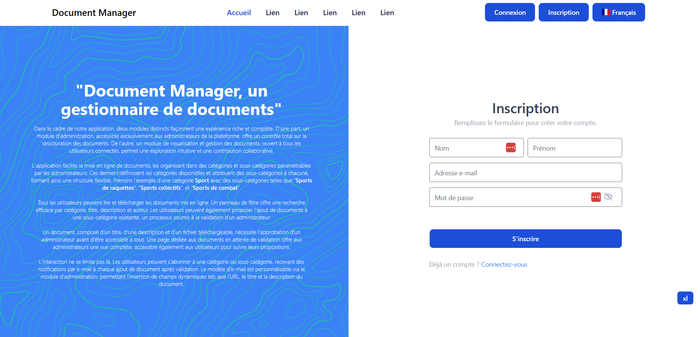

## Installation

1. Clonez ce référentiel sur votre machine locale.
2. Ouvrez un terminal et naviguez vers le répertoire du projet.
3. Pour le back-end :
   - Assurez-vous d'avoir Docker installé.
   - Exécutez la commande `docker-compose up` pour lancer l'application back-end en utilisant Docker.
4. Pour le front-end :
   - Accédez au répertoire `frontend` avec `cd frontend`.
   - Exécutez la commande `npm install` pour installer les dépendances.
   - Exécutez la commande `ng serve` pour démarrer l'application front-end en mode de développement.

### Connexion à la base de données

- SQL Server Management Studio Login
  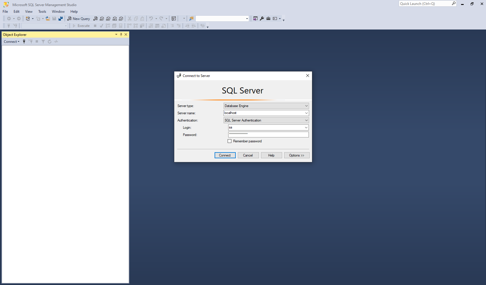

## Utilisation

1. Ouvrez l'application front-end en accédant à l'URL (`http://127.0.0.1:4200/`) fournie par la commande `ng serve`.
2. Sur la page principale, vous pouvez voir la liste de toutes vos notes existantes.
3. Cliquez sur le bouton "Ajouter une Note" pour créer une nouvelle note.
4. Remplissez le titre, le contenu et la date de la note.
5. Cliquez sur le bouton "Enregistrer" pour ajouter la note.
6. Vous pouvez également cliquer sur le bouton "J'aime" pour montrer que vous aimez une note.

## Technologies Utilisées

- [Angular v16](https://angular.io/): Angular est un framework JavaScript open-source développé par Google pour la création d'applications web dynamiques.
- [ASP.NET Core v7](https://dotnet.microsoft.com/apps/aspnet): ASP.NET Core est un framework de développement web open-source pour construire des applications modernes, performantes et évolutives.
- [Docker](https://www.docker.com/): Docker est une plateforme de conteneurisation qui facilite le déploiement d'applications dans des conteneurs logiciels.

## Swagger

Swagger est une interface interactive qui permet d'explorer et de tester facilement les endpoints de votre API. Vous pouvez accéder à Swagger en suivant ces étapes :

1. Assurez-vous que votre application est en cours d'exécution.

2. Ouvrez votre navigateur Web et accédez à l'URL suivante :

   [https://localhost:443/swagger/index.html](https://localhost:443/swagger/index.html)

3. Vous verrez une documentation Swagger interactive présentant tous les endpoints de votre API, les modèles de données, et vous pourrez même effectuer des tests directement depuis l'interface.

   Notez que l'URL peut varier selon la configuration de votre application et le port que vous utilisez.

N'hésitez pas à explorer et tester votre API à l'aide de Swagger pour une expérience de développement plus fluide.

## Mail Catcher

Pour ce projet, un outil appelé Mail Catcher est utilisé pour intercepter et afficher les e-mails générés par l'application. Les e-mails envoyés lorsqu'un utilisateur s'abonne à une liste ou lorsqu'un document est validé peuvent être consultés via Mail Catcher.

L'URL pour consulter les e-mails via Mail Catcher est : http://127.0.0.1:1080 et sur docker : http://0.0.0.0:1080

Dans Docker : dockage/mailcatcher
Lorsqu'un utilisateur s'abonne à une liste et lorsque le document est validé, un e-mail est envoyé aux abonnés de la catégorie appartenant au document
Le mail catcher est disponible ici : http://127.0.0.1:1080 et sur docker : http://0.0.0.0:1080

## Connexion à MS Studio

```shell
- Server : localhost
- User : sa
- Password : d0cument.Manager
```

Ces informations sont définis ici :
```./back/appsettings.json```
```json
"ConnectionStrings": {
  "DocumentManagerDatabase": "Server=sql-server;Database=DocumentManager;User=sa;Password=d0cument.Manager;Encrypt=True;TrustServerCertificate=True"
},
```


# Difficultés

## HTTPS

Si vous avez cette erreur `Unhandled exception. System.IO.FileNotFoundException: Could not find file '/https/aspnetapp.pfx'.`, vous devez exécuter les étapes suivantes :
Pour le certificat, veuillez exécuter ces commandes :
```shell
dotnet dev-certs https --clean
```
Comme sur la configuration du docker compose :
```shell
dotnet dev-certs https -v --trust -ep ${HOME}/.aspnet/https/aspnetapp.pfx -p r00t.R00T
```

Source : 
- https://learn.microsoft.com/en-us/aspnet/core/security/docker-compose-https
- https://learn.microsoft.com/en-us/aspnet/core/security/docker-https

## AutoMapper

Pour simplifier la correspondance entre les objets, j'ai intégré le package [AutoMapper](https://automapper.org/). Cela me permet d'établir des règles de mappage entre différents types d'objets.
Pour configurer AutoMapper, j'ai créé une classe `./back/Helpers/AutoMapperProfile.cs` héritant de `Profile`. 
Dans cette classe, j'ai défini les correspondances entre différents types d'objets à l'aide de méthodes comme `CreateMap`.

## Logger

Les logs sont généralements effectués dans les services mais pour ce projet, il y en a dans les services et les controllers.
Source : https://learn.microsoft.com/en-us/aspnet/core/fundamentals/logging/

## Seeders

Pour le seeder (```./back/Seeders/DatabaseSeeder```), j'ai utilisé Bogus.
Source : https://github.com/bchavez/Bogus

## Create et Update
Une erreur concernant le update, j'utilisais les méthodes manuelles :
// DocumentRepository.cs
public async Task<DocumentEntity?> Update(DocumentEntity? document)
{
   if (document == null) return null;
   if (!_context.Documents.Local.Contains(document))
   {
      // Attache l'entité uniquement si il n'est pas déjà suivie
      _context.Documents.Attach(document);
   }
   _context.Entry(document).State = EntityState.Modified;
   await _context.SaveChangesAsync();
   return document;
}
Réponse de l'enseignant :
Dans ton repository, tu fais tout le traitement du contexte à la main : 
Cela n'est pas nécessaire, le contexte possède des méthodes qui le font automatiquement pour chaque opération CRUD. 
En l'occurence, pour l'update, tu devrais pouvoir appeler celle-ci :
/** Update */
_context.Update(document);
Cette méthode update va automatiquement mettre à jour l'entité suivie pour que le prochain SaveChanges mette à jour correctement les données en base.

Pareil pour le create : 
/** Create */
_context.Add(document);

## UserManager .NET
Lors de la création d'un utilisateur en utilisant le UserManager de .NET dans la classe UserRepository,
mon utilisateur ne voulait pas s'insérer. En ajoutant les lignes de debug ci-dessous, le problème venait du champ UserName qui manquait.
Par conséquent, celui-ci a été ajouté avec la valeur de l'email.

    ```
    public async Task<UserEntity?> Save(UserEntity? user)
    {
        if (user == null) return null;
        IdentityResult result = await _userManager.CreateAsync(user);
        // DEBUG
        if (!result.Succeeded)
            foreach (IdentityError error in result.Errors)
                Console.WriteLine($"Oops! {error.Description} ({error.Code})");
        if (result.Succeeded)
        {
            return user;
        }
        return null;
}
    ```
    Source : https://stackoverflow.com/questions/42851608/usermanager-createasync-is-not-adding-user-to-the-database

## Internationalisation

Pour l'internationalisation, je n'ai pas utilisé celui fournit par angular (https://angular.io/guide/i18n-overview)
car il ne permet pas de gérer dynamiquement l'internationalisation (https://stackoverflow.com/questions/57256859/i-cannot-dynamically-change-language-in-angular).
J'ai utilisé celui-ci : https://github.com/ngx-translate/
```
npm install @ngx-translate/core --save
npm install @ngx-translate/http-loader --save
```
Les fichiers json de traductions sont placés dans le répertoire `assets/i18n`.

Les drapeaux :
https://github.com/lipis/flag-icons
https://www.npmjs.com/package/flag-icons
Pour le css : 
`angular.json`
```json
"styles": [
  "src/styles.css",
  "node_modules/ngx-toastr/toastr.css",
  // Ajouter le css
  "node_modules/flag-icons/css/flag-icons.min.css"
],
```

## Dépendances circulaires

```sh
npx madge --circular --extensions ts ./
```

Pour le TranslateService, il y a eu un problème de dépendence circulaire car le HTTPClient est utilisé plusieurs fois, source :
https://stackoverflow.com/questions/67152273/angular-circular-dependency-when-inject-translateservice-to-interceptor

Et aussi j'avais eu ce problème, lorsque je mettais un élement (ex: TokenStorageService) @Injectable({providedIn: 'root'}) et que je l'importais aussi dans le module donc j'ai juste décidé de le laisser dans l'import du module (ex: Module Core pour TokenStorageService)  et ne pas lui mettre @Injectable({providedIn: 'root'}).

## Améliorations :

## Organisation

### Catégorie-Document
Dans le contexte de la modélisation des relations entre les catégories et les documents :
- Un document peut être associé à plusieurs catégories, et une catégorie peut avoir plusieurs documents.
- Cependant, du point de vue de l'interface utilisateur (front-end), la gestion a été simplifiée pour permettre un document d'appartenir à une seule catégorie, tandis qu'une catégorie peut contenir plusieurs documents.
En d'autres termes, bien que la relation entre les documents et les catégories en backend soit de type "many-to-many" (plusieurs documents peuvent appartenir à plusieurs catégories et vice versa), du côté de l'interface utilisateur, la logique d'utilisation a été simplifiée pour un document par catégorie et plusieurs documents par catégorie.

### User-Role

Dans le contexte de la modélisation des relations entre les utilisateurs et les rôles :
- Un utilisateur peut être associé à plusieurs rôles, et un rôle peut être attribué à plusieurs utilisateurs.
- Cependant, du point de vue de l'interface utilisateur (front-end), la gestion a été simplifiée pour permettre à un utilisateur d'avoir un seul rôle à la fois. En d'autres termes, bien que la relation entre les utilisateurs et les rôles en backend soit de type "many-to-many" (un utilisateur peut avoir plusieurs rôles et vice versa), du côté de l'interface utilisateur, la logique d'utilisation a été simplifiée pour un rôle par utilisateur.

## Clean Architecture
Source : https://www.youtube.com/watch?v=yF9SwL0p0Y0

## Specification Pattern
Le specification pattern pour les filtres : https://enterprisecraftsmanship.com/posts/specification-pattern-c-implementation/

## Performance

- https://learn.microsoft.com/en-us/aspnet/core/performance/overview

# Informations

## Licence

Ce projet est publié sous la licence MIT. Pour plus d'informations, consultez le fichier LICENSE.

[](https://choosealicense.com/licenses/mit/)

## Crédits

- Gestion de conflits d'accès concurrentiel : https://learn.microsoft.com/fr-fr/ef/core/saving/concurrency
- Upload file : https://code-maze.com/upload-files-dot-net-core-angular/
- Accordion : https://sreyaj.dev/customizable-accordion-component-angular
- Translation : https://github.com/ngx-translate/core
- JSON Translation Converter : https://transluna.net/
- Toast : https://github.com/scttcper/ngx-toastr
